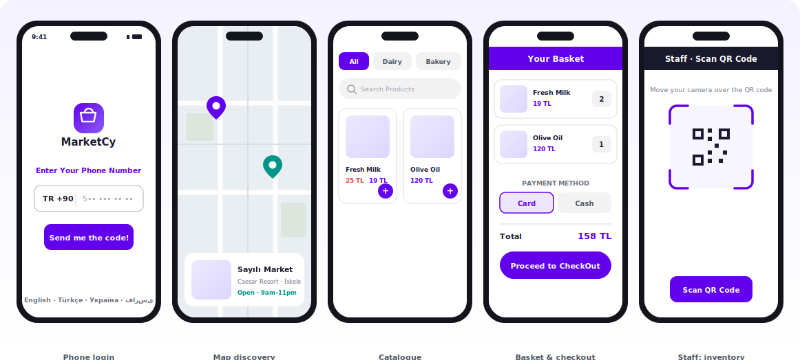
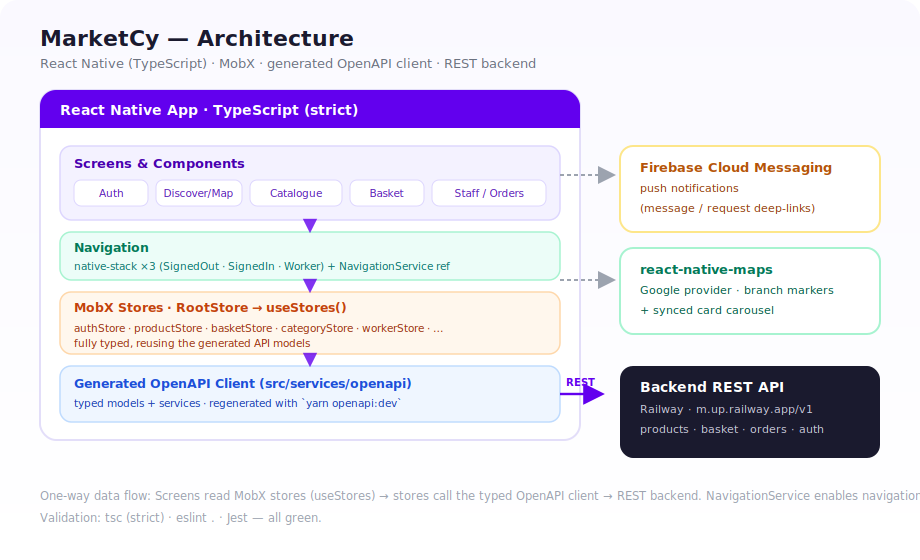

# MarketCy 🛒

> A mobile grocery-ordering and delivery app for a Northern-Cyprus supermarket — browse stores on a map, shop by category, and check out for delivery. Includes a separate **staff/admin** experience for managing inventory and fulfilling orders.


<p align="center">
  
</p>

_UI mockups of the core flows (customer + staff), rendered from the app's real screens and color palette. Drop live device captures into [`docs/screenshots/`](docs/screenshots) to swap them in._

---

## Overview

MarketCy is a **React Native (CLI)** app, written in **strict TypeScript**, built around a real supermarket chain (*Sayılı Market*, İskele).
Customers sign in with their phone number, discover store branches on an interactive map, browse the
catalogue by category, build a basket, pick a delivery address and payment method, and place an order.
A second, role-gated **staff app** lets employees scan product barcodes to manage pricing/availability
and move incoming orders through a *pending → accepted → delivered* workflow.

The client is fully decoupled from the backend through a **generated OpenAPI client** — the app talks to a
REST API and never hand-writes request/response types.

## Features

**Customer**
- 📱 Phone-number **OTP authentication**
- 🗺️ **Map discovery** of store branches (Google Maps) with animated markers and a synced card carousel
- 🛍️ **Catalogue** browsing by category with infinite scroll, search, and discount pricing
- 🧺 **Basket** with per-item quantities, live totals, and edit/remove
- 📍 **Delivery address** book and **Card / Cash** payment selection
- 🌍 **4 languages** — English, Türkçe, Українська, فارسی — switchable in-app

**Staff / Admin** (role-gated by account type)
- 🔳 **QR / barcode scanner** to look up products and set price, discount, and availability
- 📦 **Order queue** — review pending & accepted orders and **accept / reject / deliver**
- 🔔 **Push notifications** via Firebase Cloud Messaging

## Screens

| Area | Screens |
|------|---------|
| **Auth** | Phone entry → OTP verification |
| **Discover** | Map (branch markers + carousel), Markets list |
| **Shopping** | Product list (category tabs + search), Product detail modal, Basket, Address modal, Checkout |
| **Account** | Dashboard (number, address, language, sign-out) |
| **Staff** | QR scanner / product editor, Orders queue, Order detail modal |

> 📸 _The [screen preview](docs/preview.svg) up top shows these flows. Drop real device captures into [`docs/screenshots/`](docs/screenshots) to replace the mockups._

## Tech Stack

| Concern | Choice |
|---------|--------|
| Framework | React Native **0.70** (bare CLI) |
| Language | **TypeScript** (strict mode), end to end |
| State management | **MobX** (`mobx` + `mobx-react`) with a root-store / context pattern |
| Navigation | **React Navigation** native-stack + React Native Paper `BottomNavigation` tabs |
| UI kit | **React Native Paper** (Material) |
| Networking | **Axios** + an **OpenAPI-generated** TypeScript client (`src/services/openapi`) |
| Maps | `react-native-maps` (Google provider) |
| Push | **Firebase Cloud Messaging** (`@react-native-firebase/messaging`) |
| i18n | `i18next` + `react-i18next` (EN / TR / UK / FA) |
| Camera | `react-native-qrcode-scanner` (barcode scanning) |

## Architecture

<p align="center">
  
</p>

The folder layout:

```
app/
├── api/            # thin axios helpers
├── components/     # shared UI (Logo, Button, Background, LoadingOverlay)
├── core/           # Paper theme
├── router/         # navigation stacks + central NavigationService
├── screens/        # feature screens, each with a co-located MobX store
│   ├── auth/         (Intro, VerifyNumber, authStore)
│   ├── tabs/         (Markets, Map, Dashboard, Search)
│   ├── products/     (ListOfProducts, ModalEachProduct, productStore)
│   ├── basket/       (Basket, basketStore, …)
│   ├── workerScreens/(WorkerHomePage, Orders, workerStore)
│   └── translation/  (i18n setup + locale JSON)
├── store/          # RootStore wiring all feature stores into one context
└── style/          # central color palette + shared style tokens

src/services/openapi/ # auto-generated API client (models + services)
ios/ · android/        # native projects
```

**State** — every feature owns a small, fully-typed MobX store (`authStore`, `productStore`, `basketStore`, `workerStore`, …).
`store/index.ts` instantiates them once into a `RootStore` exposed through React context, so any screen reads
them with a single `useStores()` hook.

**Navigation** — three top-level stacks (`SignedOut`, `SignedIn`, `Worker`) are chosen from auth state in
`app/app.tsx`; a `NavigationService` ref allows navigation from outside the React tree (e.g. from stores).

**Types** — the app is **strict TypeScript**. Domain shapes are reused from the generated OpenAPI models via
`app/types.ts`, so stores, screens and the API client stay in lock-step.

**API client** — `src/services/openapi` is **generated**, not written by hand. Regenerate it from the running
backend with `yarn openapi:dev`, keeping client types in lock-step with the server.

## Getting Started

### Prerequisites
- **Node 18** and Yarn (or npm)
- **Xcode** (iOS) and **Android Studio** + SDKs (Android)
- **CocoaPods** (iOS): `sudo gem install cocoapods`

### Install
```bash
yarn install
# iOS only
cd ios && pod install && cd ..
```

### Run
```bash
yarn start          # Metro bundler
yarn ios            # build & run on iOS simulator/device
yarn android        # build & run on Android emulator/device
```

## Scripts

| Script | Purpose |
|--------|---------|
| `yarn start` | Start the Metro bundler |
| `yarn ios` / `yarn android` | Build & run on the platform |
| `yarn lint` | ESLint |
| `yarn typecheck` | TypeScript type-check (`tsc --noEmit`) |
| `yarn test` | Jest |
| `yarn openapi:dev` | Regenerate the API client from the dev server |
| `yarn openapi:local` | Regenerate the API client from a local server |

## Internationalization

Translations live in `app/screens/translation/<lng>/<lng>.json` (`en`, `tr`, `uk`, `fa`) and are initialised in
`app/screens/translation/i18n.js`. Every locale file mirrors the same keys; the language is switchable at runtime.

## Configuration Notes

- **Firebase** — `ios/GoogleService-Info.plist` and `android/app/google-services.json` are included; match the
  bundle id / package name to your own Firebase project if you fork. These are client identifiers, not secrets.
- **Maps** — uses `react-native-maps` with the Google provider; supply the relevant Maps API keys for each platform.
- **API base URL** — set via `OpenAPI.BASE` in `app/app.js`.

### Troubleshooting
```bash
# Metro cache
rm -rf $TMPDIR/metro-* && yarn start --reset-cache
# Android
cd android && ./gradlew clean && cd ..
# iOS pods
cd ios && pod deintegrate && pod install && cd ..
```

## License

Published as a portfolio work sample. © Armin.
